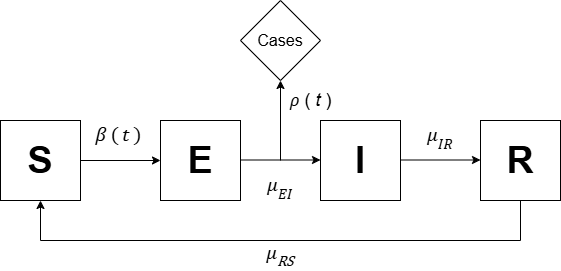
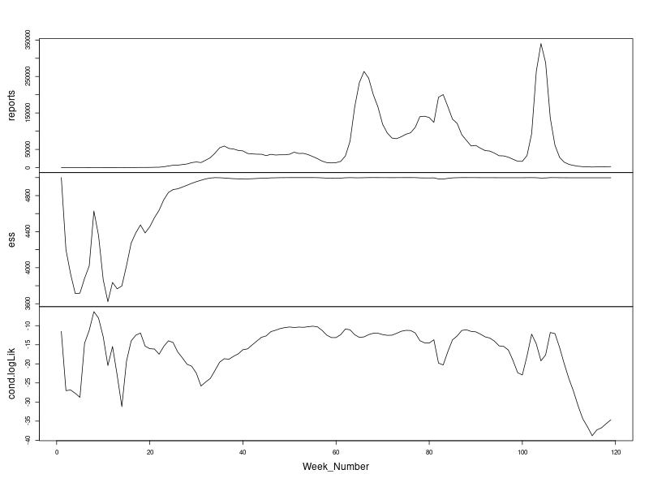
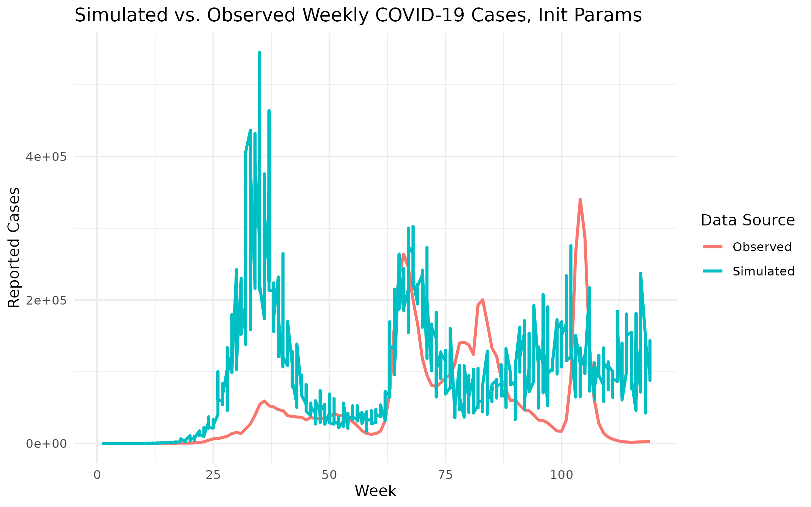
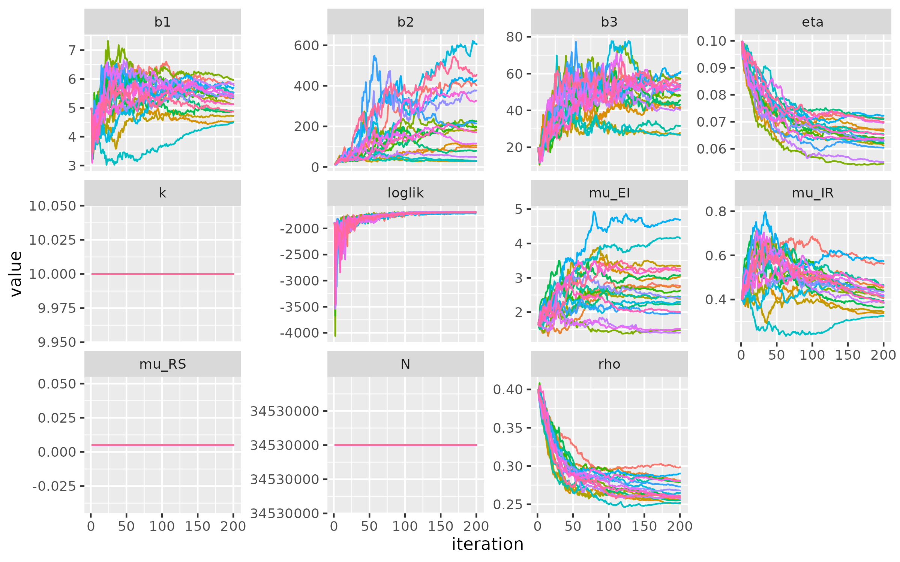
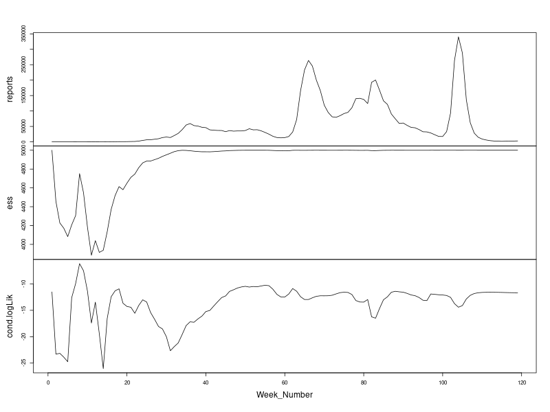
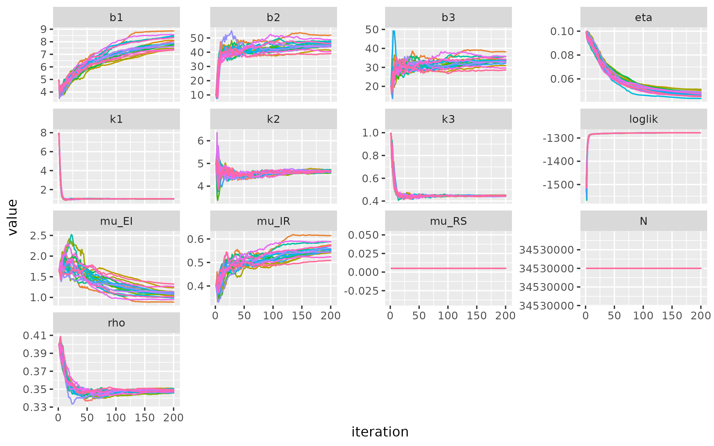
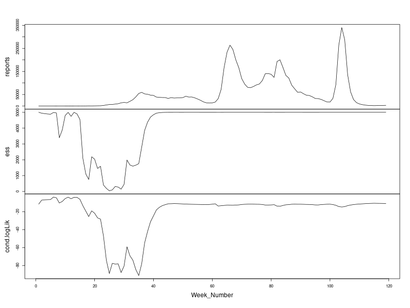
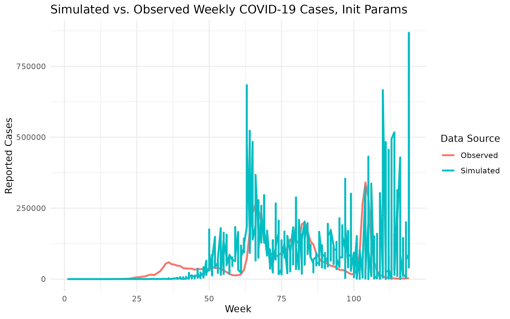
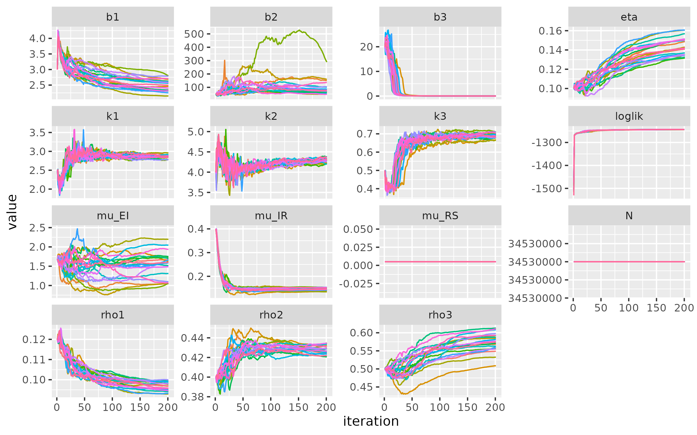
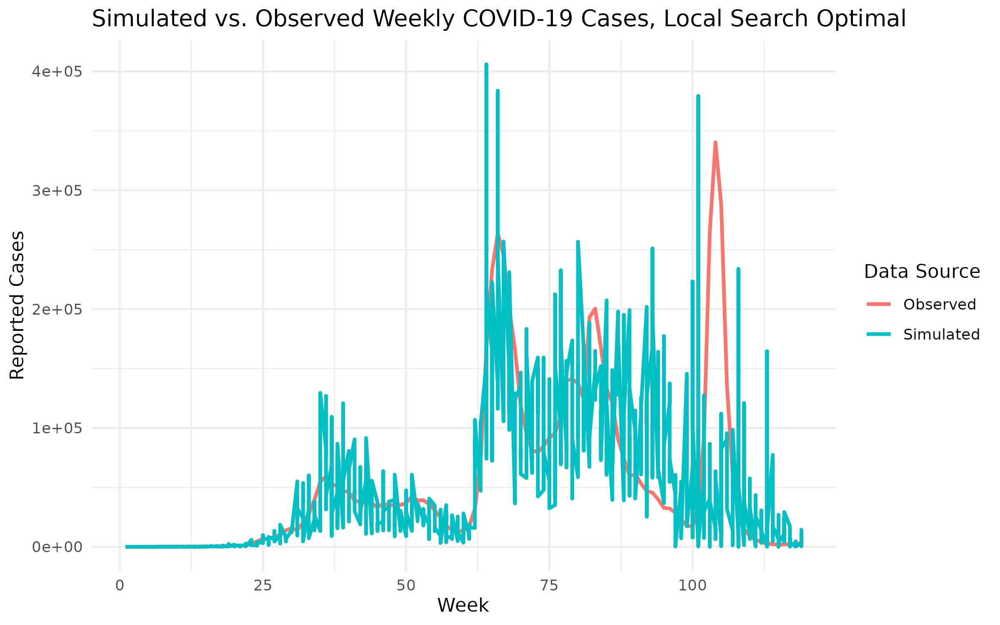

```{r setup, include=FALSE}
knitr::opts_chunk$set(echo = TRUE)
```

```{r include=FALSE}
library(forecast)
library(ggplot2)
library(dplyr)
library(tidyr)
library(kableExtra)
library(lubridate)
library(zoo)
library(fGarch, quietly = TRUE)
library(vars)
library(tseries)
library(tictoc)
library(tidyverse)
library(pomp)
library(foreach)
library(future)
library(doFuture)
library(iterators)
library(tictoc)
```

# SEIRS Model

## Model Specification

We propose a SEIRS (Susceptible - Exposed - Infectious - Recovered - Susceptible) Model, which is a compartmental epidemiological model that 
extends the classical SEIR model by including the transition from state $R$ to $S$, thus allowing re-infections.

```{r, echo=FALSE,fig.align="center", fig.width=8, fig.height=5, dpi=300}

```

The model can be characterized by the following system of differential equations,

\begin{align*}
    \frac{\mathrm{d}S}{\mathrm{d}t} &= -\mu_{SE} S(t) + \mu_{RS} R(t) \\
    \frac{\mathrm{d}E}{\mathrm{d}t} &= \mu_{SE} S(t) - \mu_{EI} E(t) \\
    \frac{\mathrm{d}I}{\mathrm{d}t} &= \mu_{EI} E(t) - \mu_{IR} I(t) \\
    \frac{\mathrm{d}R}{\mathrm{d}t} &= \mu_{IR} I(t) - \mu_{RS} R(t) \\
\end{align*}

where

-   $\mu_{SE} = \beta(t)$ is the transition rate from state $S$ to state $E$, also known as the *transmission rate*;
-   $\mu_{EI}$ is the transition rate from state $E$ to state $I$;
-   $\mu_{IR}$ is the transition rate from state $I$ to state $R$;
-   $\mu_{RS}$ is the transition rate from state $R$ to state $S$;
-   $N(t) = S(t) + E(t) + I(t) + R(t)$ is the population size, which is assumed to be constant throughout the epidemic.

In order to discretize the model, we assume that each transition between compartments is a *binomial* random variable, *i.e.* 
\begin{align*}
\Delta N_{SE} &= Binomial(S, 1 - e^{-\beta(t) \frac{I \Delta t}{N}}) \\
\Delta N_{EI} &= Binomial(E, 1 - e^{-\mu_{EI} \Delta t}) \\
\Delta N_{IR} &= Binomial(I, 1 - e^{-\mu_{IR} \Delta t}) \\
\Delta N_{RS} &= Binomial(R, 1 - e^{-\mu_{RS} \Delta t}) \\
\end{align*}

As demonstrated in earlier sections, the sample period can be segmented into three distinct phases. Accordingly, we allow the transmission rate, $\beta(t)$, 
to vary across these phases to reflect changes in underlying epidemic dynamics. Specifically, let $\beta(t)$ be a piecewise function *s.t.*
\begin{equation*} \beta(t) = \left\{
\begin{matrix}
b_1, & t \in [1, 61] \\
b_2, & t \in [62, 96] \\
b_3, & t \in [63, 119]
\end{matrix}
\right.\end{equation*}

Additionally, we assume a negative binomial distribution for the number of reported cases $Y(t)$ with fixed dispersion parameter $k$, *i.e.* 
$$ Y \sim NegBinom(\rho * H, \rho * H + \frac{(\rho H)^2}{k}) $$ where

-   $\rho$ is the reporting rate
-   $H$ is the number of total infections per week
-   $k=10$ is the fixed parameter 

Moreover, given the large population size in Kerala, the initial number of infected individuals was set to 1,000 to ensure that the first outbreak 
unfolds within a reasonable time frame.

## Why not SEIR

We do not start with the SEIR model since it assumes that recovered individuals gain *permanent* immunity, which is inconsistent with 
the multiple outbreaks we have observed in Kerala during the sample time interval. 

Alternatively, we consider adding the $R \rightarrow S$ route in order to allow recovered individuals to lose immunity over time, return 
to the susceptible state, thus enabling re-infections. 
Without this transition, the SEIR model would eventually trap all individuals in $R$ forever with enough time, leading to unrealistic depletion 
of susceptibles and underestimation of future waves. 


## SEIRS, with Time-varying $\beta$

We began our analysis with a SEIRS model featuring time-varying transmission rates across three epidemic phases, 
while initially holding the dispersion parameter $(k)$ and the reporting rate $(\rho)$ fixed. This setup captured changes in disease 
transmission but did not account for evolving uncertainty in reported case counts or shifts in surveillance quality. 

### Initial Guesses
We begin with a population size of $N = 34,530,000$, which is derived based on the 2011 cencus data and an annual growth rate of **fill in the blank** 
For simplicity, $N$ is assumed constant throughout the sample time period. The initial guess for the parameters are as follows.
\begin{equation*} \beta(t) = \left\{
\begin{matrix}
  b_1 = 5, b_2 = 10, b_3 = 20, \\
  \mu_{EI} = 1.67, \mu_{IR} = 0.5, \mu_{RS} = 0.005, \\
  \rho = 0.4, \\
  k = 10, \\
  \eta = 0.1 \\
\end{matrix}
\right.\end{equation*}

We expect $\beta(t)$ to increase over time since the sample period reveals three distinct waves, each increasing in magnitude, suggesting rising 
transmissibility. Besides, the median incubation period is assumed to be 4.5-5.8 days
^[Lauer, S. A., Grantz, K. H., Bi, Q., Jones, F. K., Zheng, Q., Meredith, H. R., Azman, A. S., Reich, N. G., & Lessler, J. (2020). The Incubation Period of Coronavirus Disease 2019 (COVID-19) From Publicly Reported Confirmed Cases: Estimation and Application. Annals of internal medicine, 172(9), 577–582. https://doi.org/10.7326/M20-0504], 
The infectious period is usually believed to be 1-2 days before and 8-10 days after symptoms begin. To include a buffer for late recovery or reporting delays
up to half a week, we assume this period to be 2.5 weeks. 
Hence, we set $\mu_{EI} = 1.67$, and $\mu_{IR} = 0.5$

Moreover, $\eta$ is set to $0.1$ considering the large population size in Kerala. Large $N$ implies high absolute infection counts in spite of small proportions,
which would possibly sufficient for the early seeding of the outbreaks.

Finally, we discovered that $\mu_{RS} = 0.005$ would be a biologically plausible value.
Since the population is very large, while the cumulative number of infections remains relatively small, 
the proportion of individuals who have recovered (*i.e.*, entered the $R$ compartment) is also minimal. In such cases, 
the model is insensitive to the exact value of $\mu_{RS}$, meaning it may be safely fixed to a plausible value for improved model stability.

**We may put Puzhu's reasoning for the scales here** 

```{r, eval = FALSE, echo = FALSE}
registerDoFuture()

cores <- as.integer(Sys.getenv("SLURM_CPUS_PER_TASK"))
if (is.na(cores) || cores < 1) cores <- parallel::detectCores(logical=FALSE)

plan(multisession, workers = cores)

set.seed(1350254336)

KERALA_POP = 34530000

NP = 5000; NMIF = 200; NUM_GUESSES = 400
# NP = 200; NMIF = 10; NUM_GUESSES = 40 # debug line

cat("[INFO] Iteration parameters: Np =", NP, " | Nmif =", NMIF, "\n")

interval = c(61, 35, 23) # DO NOT change the first entry. It's the time when the vaccination program started.

cat(sprintf("[INFO] Time interval (in weeks): [1 - %d], [%d - %d], [%d - %d]\n", interval[1], interval[1] + 1, interval[1] + interval[2], 
    interval[1] + interval[2] + 1, sum(interval)))


# The code for the SEIR model is developed from https://kingaa.github.io/sbied/pfilter/model.R

covid_data = read.csv("./data/weekly_df.csv")


seir_step <- Csnippet("

  double Beta;
  if (interval == 1) Beta = b1;
  else if (interval == 2) Beta = b2;
  else Beta = b3;

  double dN_SE = rbinom(S,1-exp(-Beta*I/N*dt));
  double dN_EI = rbinom(E,1-exp(-mu_EI*dt));
  double dN_IR = rbinom(I,1-exp(-mu_IR*dt));

  double dN_RS = rbinom(R, 1 - exp(-mu_RS*dt));

  S -= dN_SE - dN_RS;

  E += dN_SE - dN_EI;
  I += dN_EI - dN_IR;
  R += dN_IR;
  H += dN_IR;
")
 
seir_init <- Csnippet("
  S = nearbyint(eta*N);
  E = 0;
  I = 1000;
  R = nearbyint((1-eta)*N);
  H = 0;
")

dmeas <- Csnippet("
  double mean_reports = fmax(rho * H, 1e-5);
  lik = dnbinom_mu(reports, k, mean_reports, give_log);
")

rmeas <- Csnippet("
  reports = rnbinom_mu(k,rho*H);"
)

emeas <- Csnippet("
  E_reports = rho*H;"
)

time_indicators = covariate_table(
    t = covid_data$Week_Number,
    interval = c(rep(1, interval[1]), rep(2, interval[2]), rep(3, interval[3])), 
    times = "t")

## MODEL INIT

init_params = c(b1=5,b2=10,b3=20,rho=.4, mu_EI=1/0.6, mu_IR=1/2.5, mu_RS = .005, k=10, eta=.1,N=KERALA_POP) 

cat("[INFO] Initial model parameters:\n")
setNames(sprintf("%.3f", init_params), names(init_params))

covid_data |>
  select(Week_Number,reports=Confirmed) |>
  filter(Week_Number<=119) |>
  pomp(
    times="Week_Number",t0=1,
    rprocess=euler(seir_step,delta.t=1/7),
    rinit=seir_init,
    rmeasure=rmeas,
    dmeasure=dmeas,
    emeasure=emeas,
    accumvars="H",
    statenames=c("S", "E","I","R","H"),
    paramnames=c("b1","b2","b3","mu_EI","mu_IR", "mu_RS", "eta","rho","k","N"),
    params=init_params,
    covar = time_indicators
  ) -> COVID_SEIR
```

We continue by examing the particle filters and plotting the simulations based on our initial parameters:
```{r, eval = FALSE, echo = FALSE}
### Check the particle filter

COVID_SEIR |> pfilter(Np = 5000) -> p_filter
png("./pic/ess_init.png", width = 800, height = 600)
plot(p_filter)
dev.off()

### Simulation based on initial params

sim_df <- simulate(COVID_SEIR, nsim = 5, format = "data.frame") |>
  select(Week_Number, .id, reports) |>
  mutate(source = "Simulated")

real_df <- covid_data |>
  select(Week_Number, Confirmed) |>
  rename(reports = Confirmed) |>
  mutate(source = "Observed")

(
  bind_rows(sim_df, real_df) |>
  ggplot(aes(x = Week_Number, y = reports, color = source)) +
  geom_line(linewidth = 1) +
  labs(
    title = "Simulated vs. Observed Weekly COVID-19 Cases, Init Params",
    x = "Week",
    y = "Reported Cases",
    color = "Data Source"
  ) +
  theme_minimal()
  ) |>
  ggsave(
    filename = "./pic/sim_init.png",
    plot = _,
    width = 8,
    height = 5,
    dpi = 300
  )
```
```{r echo=FALSE, fig.show="hold",out.width="49%"}


```

Our initial parameters have managed to capture the timeline for most outbreaks, but failed to estimate the magnitudes. 

## Local Search

We conducted the local search using 5,000 particle filters, 200 iterations.

```{r, eval = FALSE, echo=FALSE}
## LOCAL SEARCH
# step_size = c(b1 = .01, b2=.02, b3 = .02, rho = .002, eta = .02)
step_size = rw_sd(b1 = .01, b2=.02, b3 = .02, mu_EI = .005, mu_IR = .005, 
              mu_RS = .00, rho = .002, eta = ivp(.02))
cat("[INFO] Local search initiated.\n")
cat("[INFO] Step size:\n")
# setNames(sprintf("%.3f", step_size), param_names)
print(step_size@call)

bake(file="local_search.rds",{
  foreach(i=1:20,.combine=c,
    .options.future=list(seed=482947940)
  ) %dopar% {
    COVID_SEIR |>
      mif2(
        Np=NP, Nmif=NMIF,
        cooling.fraction.50=0.5,
        rw.sd = step_size,
        # partrans=parameter_trans(log=c("b1","b2","b3"),logit=c("rho","eta")),
        # paramnames=c("b1","b2","b3","rho","eta")
        partrans=parameter_trans(log=c("b1","b2","b3", "mu_EI", "mu_IR",
        "mu_RS"),logit=c("rho","eta")),
        paramnames=c("b1","b2","b3","mu_EI", "mu_IR", "mu_RS", "rho","eta")
      )
  } -> mifs_local
  attr(mifs_local,"ncpu") <- nbrOfWorkers()
  mifs_local
}) -> mifs_local


bake(file="lik_local.rds",{
  foreach(mf=mifs_local,.combine=rbind,
    .options.future=list(seed=900242057)
  ) %dopar% {
    evals <- replicate(10, logLik(pfilter(mf,Np=NP)))
    ll <- logmeanexp(evals,se=TRUE)
    mf |> coef() |> bind_rows() |>
      bind_cols(loglik=ll[1],loglik.se=ll[2])
  } -> results
  attr(results,"ncpu") <- nbrOfWorkers()
  results
}) -> results_local

results_local_maxll = results_local |> arrange(desc(loglik)) |> slice(1)
best_params_local = results_local_maxll |> select(b1:N) |> as.list() |> unlist()

cat("[INFO] Local search completed, model dumped to 'local_search.rds'.\n")
cat("[INFO] Best parameters:\n")
setNames(sprintf("%.3f", best_params_local), names(best_params_local))

cat("[INFO] Est. loglik =", round(results_local_maxll["loglik"] |> as.numeric(), 2), " | SE =", 
    round(results_local_maxll["loglik.se"] |> as.numeric(), 4), "\n")

## Plots for local search

(mifs_local |>
  traces() |>
  melt() |>
  ggplot(aes(x=iteration,y=value,group=.L1,color=factor(.L1)))+
  geom_line()+
  guides(color="none")+
  facet_wrap(~name,scales="free_y")) |>
  ggsave(
    filename = "./pic/local_search.png",
    plot = _,
    width = 8,
    height = 5,
    dpi = 300
  )

COVID_SEIR_local <- COVID_SEIR |> pomp(params = best_params_local)

### Check the particle filter

COVID_SEIR_local |> pfilter(Np = 5000) -> p_filter
png("./pic/ess_local.png", width = 800, height = 600)
plot(p_filter)
dev.off()

sim_df_local <- simulate(COVID_SEIR_local, nsim = 5, format = "data.frame") |>
  select(Week_Number, .id, reports) |>
  mutate(source = "Simulated")

(
  bind_rows(sim_df_local, real_df) |>
  ggplot(aes(x = Week_Number, y = reports, color = source)) +
  geom_line(linewidth = 1) +
  labs(
    title = "Simulated vs. Observed Weekly COVID-19 Cases, Local Search Optimal",
    x = "Week",
    y = "Reported Cases",
    color = "Data Source"
  ) +
  theme_minimal()
  ) |>
  ggsave(
    filename = "./pic/sim_local.png",
    plot = _,
    width = 8,
    height = 5,
    dpi = 300
  )

```

The diagnostics plot is as follows. The log-likelihood plot shows rapid improvement in the early iterations, followed by clear 
stabilization around iteration 100, indicating good convergence of the local search. Most parameter trajectories 
(*i.e.*, \(b_1\), \(b_3\), \(\mu_{EI}\), \(\mu_{IR}\), \(\eta\), \(\rho\)) show convergence, though some (like \(b_2\)) 
exhibit more variability. Fixed parameters (\(k\), \(\mu_{RS}\), \(N\)) remain constant as expected.
```{r, echo=FALSE,fig.align="center", out.width="75%"}

```

Finally, the locally optimal parameters and the simulation based on them are as follows.
```{r, echo=FALSE, fig.align="center",out.width="70%"}
results_local = readRDS("./local_results/seirs_const/lik_local.rds")
results_local_maxll = results_local |> arrange(desc(loglik)) |> slice(1)
best_params_local = results_local_maxll |> as.list() |> unlist()
print(best_params_local)
knitr::include_graphics("./local_results/seirs_const/pic/sim_local.png")
```
The simulation suggests that the model can closely capture the timing and general shape of the second major outbreak,
but tend to overestimate the magnitude and exhibit greater volatility during the first wave, and fail to capture any 
volatilities in the third. Changes in model structure could be necessary if the global search cannot lead to significant 
improvements in model performance.

## Global Search

```{r}

```

## SEIRS with Multi-stage Beta and K

### Model Modification

We modify our negative binomial distribution for the number of reported cases $Y(t)$ with time-varying dispersion, *i.e.* 
$$ Y \sim NegBinom(\rho * H, \rho * H + \frac{(\rho H)^2}{k(t)}) $$ where

-   $\rho$ is the reporting rate

-   $H$ is the number of total infections per week

-   $k(t)$ is the interval-specific dispersion parameter which satisfies that 
    \begin{equation*} k(t) = \left\{
    \begin{matrix}
    k_1, & t \in [1, 61] \\
    k_2, & t \in [62, 96] \\
    k_3, & t \in [63, 119]
    \end{matrix}
    \right.\end{equation*}

Allowing the dispersion parameter \(k(t)\) in the negative binomial distribution to vary over time is 
justified by both practical and statistical considerations. 
Reporting consistency often changes across epidemic phases due to factors such as evolving testing policies, delays, or 
improvements in data infrastructure, which lead to varying levels of noise in reported case counts. A fixed \(k\) 
cannot capture this non-constant overdispersion, whereas a time-varying specification enables the model to reflect these 
shifts more realistically. Empirically, this adjustment improves model flexibility and fit by allowing the 
observation process to adapt to different levels of variability over time, leading to increased likelihoods.

The initial guess is almost the same as the previous section, except that 
$$ k_1 = 8, k_2 = 5, k_3 = 1 $$

```{r, echo=FALSE, eval=FALSE}
dmeas <- Csnippet("

  double k;
  if (interval == 1) k = k1;
  else if (interval == 2) k = k2;
  else k = k3;

  double mean_reports = fmax(rho * H, 1e-5);
  lik = dnbinom_mu(reports, k, mean_reports, give_log);
")

rmeas <- Csnippet("

  double k;
  if (interval == 1) k = k1;
  else if (interval == 2) k = k2;
  else k = k3;

  reports = rnbinom_mu(k,rho*H);"
)
COVID_SEIR |>
  pomp(
    rmeasure=rmeas,
    dmeasure=dmeas,
    # paramnames=c("b1","b2","b3","mu_EI","mu_IR", "mu_RS", "eta","rho","k","N"),
    paramnames=c("b1","b2","b3","mu_EI","mu_IR", "mu_RS", "eta","rho","k1", "k2", "k3", "N"),
    params=init_params,
    covar = time_indicators
  ) -> COVID_SEIR

### Check the particle filter

COVID_SEIR |> pfilter(Np = 5000) -> p_filter
png("./pic/ess_init.png", width = 800, height = 600)
plot(p_filter)
dev.off()

### Simulation based on initial params

sim_df <- simulate(COVID_SEIR, nsim = 5, format = "data.frame") |>
  select(Week_Number, .id, reports) |>
  mutate(source = "Simulated")

real_df <- covid_data |>
  select(Week_Number, Confirmed) |>
  rename(reports = Confirmed) |>
  mutate(source = "Observed")

(
  bind_rows(sim_df, real_df) |>
  ggplot(aes(x = Week_Number, y = reports, color = source)) +
  geom_line(linewidth = 1) +
  labs(
    title = "Simulated vs. Observed Weekly COVID-19 Cases, Init Params",
    x = "Week",
    y = "Reported Cases",
    color = "Data Source"
  ) +
  theme_minimal()
  ) |>
  ggsave(
    filename = "./pic/sim_init.png",
    plot = _,
    width = 8,
    height = 5,
    dpi = 300
  )
```

Again, we may check the particle filter and do the simulations.

```{r, echo=FALSE, fig.show="hold",out.width="49%"}

knitr::include_graphics("./local_results/seirs_varying_k/pic/sim_init.png")
```


## Local Search

We start another round of local search based on the expanded parameter space. 
The number of particles and iterations are unchanged. 

```{r, eval=FALSE, echo = FALSE}
bake(file="local_search.rds",{
  foreach(i=1:20,.combine=c,
    .options.future=list(seed=482947940)
  ) %dopar% {
    COVID_SEIR |>
      mif2(
        Np=NP, Nmif=NMIF,
        cooling.fraction.50=0.5,
        rw.sd = step_size,
        # partrans=parameter_trans(log=c("b1","b2","b3"),logit=c("rho","eta")),
        # paramnames=c("b1","b2","b3","rho","eta")
        partrans=parameter_trans(log=c("b1","b2","b3", "k1", "k2", "k3", "mu_EI", "mu_IR",
        "mu_RS"),logit=c("rho","eta")),
        paramnames=c("b1","b2","b3", "k1", "k2", "k3", "mu_EI", "mu_IR", "mu_RS", "rho","eta")
      )
  } -> mifs_local
  attr(mifs_local,"ncpu") <- nbrOfWorkers()
  mifs_local
}) -> mifs_local


bake(file="lik_local.rds",{
  foreach(mf=mifs_local,.combine=rbind,
    .options.future=list(seed=900242057)
  ) %dopar% {
    evals <- replicate(10, logLik(pfilter(mf,Np=NP)))
    ll <- logmeanexp(evals,se=TRUE)
    mf |> coef() |> bind_rows() |>
      bind_cols(loglik=ll[1],loglik.se=ll[2])
  } -> results
  attr(results,"ncpu") <- nbrOfWorkers()
  results
}) -> results_local

results_local_maxll = results_local |> arrange(desc(loglik)) |> slice(1)
best_params_local = results_local_maxll |> select(b1:N) |> as.list() |> unlist()

cat("[INFO] Local search completed, model dumped to 'local_search.rds'.\n")
cat("[INFO] Best parameters:\n")
setNames(sprintf("%.3f", best_params_local), names(best_params_local))

cat("[INFO] Est. loglik =", round(results_local_maxll["loglik"] |> as.numeric(), 2), " | SE =", 
    round(results_local_maxll["loglik.se"] |> as.numeric(), 4), "\n")
```


Compared to the previous plot, this diagnostics plot shows **much faster and more stable convergence** across both 
log likelihood and parameter trajectories. The log likelihood stabilizes quickly with minimal variability between chains, 
indicating stronger agreement and better local optimization.

For parameters, the inclusion of \(k_1\), \(k_2\), and \(k_3\) leads to a slightly **higher-dimensional parameter space**, 
yet their trajectories converge sharply, especially \(k_1\) and \(k_3\), which stabilize early. 
In contrast to the earlier plot, this suggests **improved identifiability and reduced noise**, possibly due to better
initialization or more informative structure of the model. 
Parameters like \(b_1\), \(b_2\), and \(\mu_{IR}\) show clearer and more uniform convergence trends across chains. 
However, the steady decline of \(\eta\) across iterations is concerning, as it suggests the model increasingly favors 
a smaller initial susceptible population, which may be unrealistic. 
This could indicate issues with parameter identifiability or compensatory behavior to fit later outbreak waves.
Overall, the model appears more stable and well-calibrated than before.

```{r, echo=FALSE,fig.align="center", out.width="75%"}

```

The locally optimal parameters and the simulation based on them are as follows.
```{r, echo=FALSE, fig.align="center",out.width="70%"}
results_local = readRDS("./local_results/seirs_varying_k/lik_local.rds")
results_local_maxll = results_local |> arrange(desc(loglik)) |> slice(1)
best_params_local = results_local_maxll |> as.list() |> unlist()
print(best_params_local)
knitr::include_graphics("./local_results/seirs_varying_k/pic/sim_local.png")
```
While most of the simulation aligns reasonably well with the timing and scale of observed waves, 
the first spike shows a clear anomaly from one of the simulations, with one trajectory exceeding 1.5 million reported 
cases in a single week, which is far above the observed data. 
This outlier suggests instability or overdispersion in that interval, 
likely driven by parameter uncertainty or an extreme realization, 
while the rest of the simulations remain within a plausible range.


## Global Search

### Narrower Global Search

```{r}

```

### Wider Global Search

```{r}

```

## Profile Likelihood and Confidence Interval

### A Stable Local Optimum

```{r}

```

### Wider Global Search and Global Optimum

```{r}

```

# SEIRS (Multi-stage Beta, K, Rho)

## Model Modification

We modify our negative binomial distribution for the number of reported cases $Y(t)$ with time-varying reporting rate and dispersion, *i.e.* 
$$ Y \sim NegBinom(\rho(t) * H, \rho(t) * H + \frac{(\rho(t) H)^2}{k(t)}) $$ 
where

-   $\rho(t)$ is the interval-specific reporting rate which satisfies that 
    \begin{equation*} k(t) = \left\{
    \begin{matrix}
    \rho_1, & t \in [1, 61] \\
    \rho_2, & t \in [62, 96] \\
    \rho_3, & t \in [63, 119]
    \end{matrix}\right.\end{equation*}

-   $H$ is the number of total infections per week

-   $k(t)$ is the interval-specific dispersion parameter which satisfies that \begin{equation*} k(t) = \left\{
    \begin{matrix}
    k_1, & t \in [1, 61] \\
    k_2, & t \in [62, 96] \\
    k_3, & t \in [63, 119]
    \end{matrix}
    \right.\end{equation*}

Varying only \(k(t)\) allows the model to adjust the **dispersion** (i.e., variability) around the expected number of 
reported cases, but it does **not** affect the **mean** of the observation distribution. As a result, it cannot account 
for changes in the actual **level of underreporting or detection bias** over time. If the true proportion of cases being 
reported fluctuates due to changes in testing access, public behavior, or policy, this cannot be captured by adjusting \(k(t)\) alone.

Allowing \(\rho(t)\) to vary provides a crucial degree of freedom: it directly scales the **mean** of reported 
cases relative to total infections. This enables the model to more accurately track the impact of dynamic surveillance 
conditions and align simulated case levels with observed data. In combination with time-varying \(k(t)\), varying \(\rho(t)\) 
allows the model to separately account for both **changes in case detection** and **changes in reporting consistency**, leading 
to improved fit, more realistic epidemic dynamics, and better-informed inference about transmission and immunity.


```{r, echo=FALSE, eval=FALSE}
dmeas <- Csnippet("
  double rho;
  if (interval == 1) rho = rho1;
  else if (interval == 2) rho = rho2;
  else rho = rho3;
  
  double k;
  if (interval == 1) k = k1;
  else if (interval == 2) k = k2;
  else k = k3;

  double mean_reports = fmax(rho * H, 1e-5);
  lik = dnbinom_mu(reports, k, mean_reports, give_log);
")

rmeas <- Csnippet("
  double rho;
  if (interval == 1) rho = rho1;
  else if (interval == 2) rho = rho2;
  else rho = rho3;
  
  double k;
  if (interval == 1) k = k1;
  else if (interval == 2) k = k2;
  else k = k3;

  reports = rnbinom_mu(k,rho*H);"
)

emeas <- Csnippet("
  double rho;
  if (interval == 1) rho = rho1;
  else if (interval == 2) rho = rho2;
  else rho = rho3;
  
  E_reports = rho*H;"
)

COVID_SEIR |>
  pomp(
    rmeasure=rmeas,
    dmeasure=dmeas,
    emeasure=emeas,
    # paramnames=c("b1","b2","b3","mu_EI","mu_IR", "mu_RS", "eta","rho","k","N"),
    paramnames=c("b1","b2","b3","mu_EI","mu_IR", "mu_RS", "eta","rho1","rho2", "rho3", "k1", "k2", "k3", "N"),
    params=init_params,
  ) -> COVID_SEIR
```

```{r, echo=FALSE, fig.show="hold",out.width="49%"}


```


## Local Search

```{r, eval=FALSE, echo=FALSE}
step_size = rw_sd(b1 = .01, b2=.02, b3 = .02, mu_EI = .005, mu_IR = .005, 
                  mu_RS = .00, rho1 = .002, rho2 = .002, rho3 = .002, k1 = .01, k2 = .02, k3 = .02, eta = ivp(.02))
cat("[INFO] Local search initiated.\n")
cat("[INFO] Step size:\n")
# setNames(sprintf("%.3f", step_size), param_names)
print(step_size@call)

bake(file="local_search.rds",{
  foreach(i=1:20,.combine=c,
          .options.future=list(seed=482947940)
  ) %dopar% {
    COVID_SEIR |>
      mif2(
        Np=NP, Nmif=NMIF,
        cooling.fraction.50=0.5,
        rw.sd = step_size,
        # partrans=parameter_trans(log=c("b1","b2","b3"),logit=c("rho","eta")),
        # paramnames=c("b1","b2","b3","rho","eta")
        partrans=parameter_trans(log=c("b1","b2","b3", "k1", "k2", "k3", "mu_EI", "mu_IR",
                                       "mu_RS"),logit=c("rho1","rho2", "rho3","eta")),
        paramnames=c("b1","b2","b3", "k1", "k2", "k3", "mu_EI", "mu_IR", "mu_RS", "rho1","rho2", "rho3","eta")
      )
  } -> mifs_local
  attr(mifs_local,"ncpu") <- nbrOfWorkers()
  mifs_local
}) -> mifs_local


bake(file="lik_local.rds",{
  foreach(mf=mifs_local,.combine=rbind,
          .options.future=list(seed=900242057)
  ) %dopar% {
    evals <- replicate(10, logLik(pfilter(mf,Np=NP)))
    ll <- logmeanexp(evals,se=TRUE)
    mf |> coef() |> bind_rows() |>
      bind_cols(loglik=ll[1],loglik.se=ll[2])
  } -> results
  attr(results,"ncpu") <- nbrOfWorkers()
  results
}) -> results_local

results_local_maxll = results_local |> arrange(desc(loglik)) |> slice(1)
best_params_local = results_local_maxll |> select(b1:N) |> as.list() |> unlist()

cat("[INFO] Local search completed, model dumped to 'local_search.rds'.\n")
cat("[INFO] Best parameters:\n")
setNames(sprintf("%.3f", best_params_local), names(best_params_local))

cat("[INFO] Est. loglik =", round(results_local_maxll["loglik"] |> as.numeric(), 2), " | SE =", 
    round(results_local_maxll["loglik.se"] |> as.numeric(), 4), "\n")


## Plots for local search

(mifs_local |>
    traces() |>
    melt() |>
    ggplot(aes(x=iteration,y=value,group=.L1,color=factor(.L1)))+
    geom_line()+
    guides(color="none")+
    facet_wrap(~name,scales="free_y")) |>
  ggsave(
    filename = "./pic/local_search.png",
    plot = _,
    width = 8,
    height = 5,
    dpi = 300
  )


COVID_SEIR_local <- COVID_SEIR |> pomp(params = best_params_local)

### Check the particle filter

COVID_SEIR_local |> pfilter(Np = 5000) -> p_filter
png("./pic/ess_local.png", width = 800, height = 600)
plot(p_filter)
dev.off()

sim_df_local <- simulate(COVID_SEIR_local, nsim = 5, format = "data.frame") |>
  select(Week_Number, .id, reports) |>
  mutate(source = "Simulated")

(
  bind_rows(sim_df_local, real_df) |>
    ggplot(aes(x = Week_Number, y = reports, color = source)) +
    geom_line(linewidth = 1) +
    labs(
      title = "Simulated vs. Observed Weekly COVID-19 Cases, Local Search Optimal",
      x = "Week",
      y = "Reported Cases",
      color = "Data Source"
    ) +
    theme_minimal()
) |>
  ggsave(
    filename = "./pic/sim_local.png",
    plot = _,
    width = 8,
    height = 5,
    dpi = 300
  )
```


The log-likelihood trajectories here show similarly rapid convergence and stabilization, indicating that the local search 
successfully identified a high-likelihood region even in the expanded parameter space with time-varying \(\rho(t)\).

Parameter-wise, most estimates demonstrate stable convergence, including the time-varying dispersion terms 
\(k_1, k_2, k_3\) and reporting rates \(\rho_1, \rho_2, \rho_3\), though there is more variability across 
chains, especially in \(b_2\) and \(\mu_{EI}\). Unlike earlier results where \(\eta\) decreased steadily, 
here it **increases over iterations**, which may better reflect a realistic susceptible population given the large \(N\). 
Overall, despite the richer parameterization, the model remains well-behaved and converges stably.

```{r, echo=FALSE,fig.align="center", out.width="75%"}

```

The locally optimal parameters and the simulation based on them are as follows.
```{r, echo=FALSE, fig.align="center",out.width="70%"}
results_local = readRDS("./local_results/seirs_varying_k_rho/lik_local.rds")
results_local_maxll = results_local |> arrange(desc(loglik)) |> slice(1)
best_params_local = results_local_maxll |> as.list() |> unlist()
print(best_params_local)

```

This simulation aligns closely with the observed data in terms of overall wave timing and peak locations, 
especially during the second and third outbreak periods. The amplitude of the simulated peaks is more consistent 
with the observed values compared to earlier models, indicating improved calibration. 
Overall, the fit demonstrates strong agreement with the empirical trend while allowing for stochastic variation.


## Global Search

```{r}

```

## Profile Likelihood and Confidence Interval
