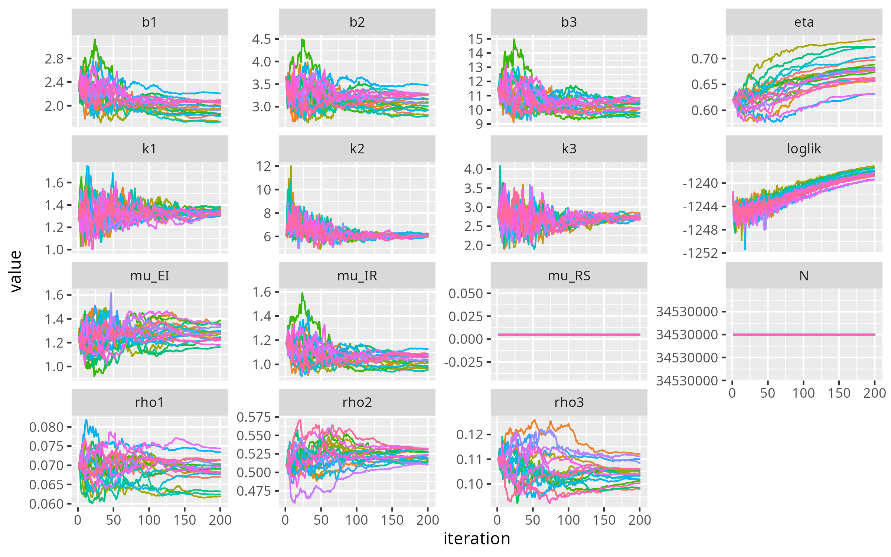
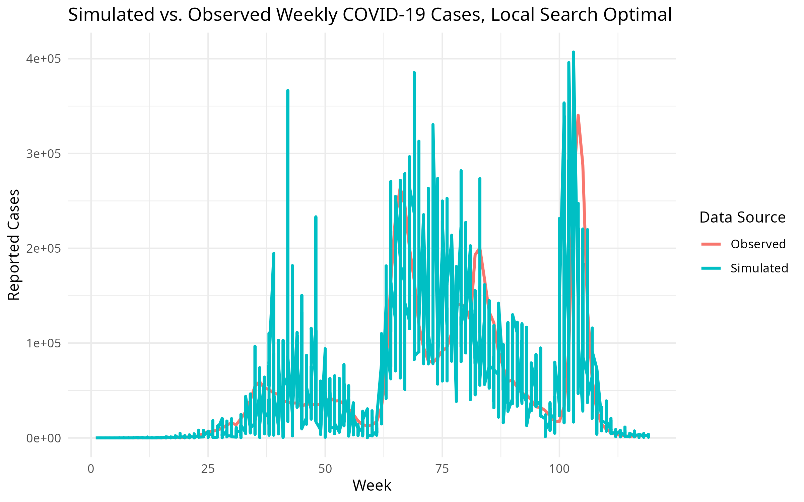
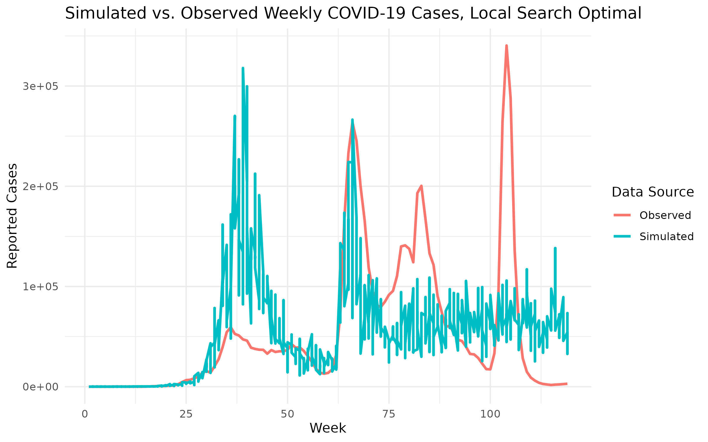
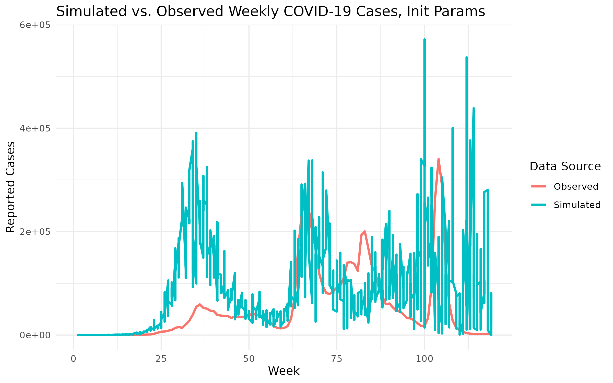
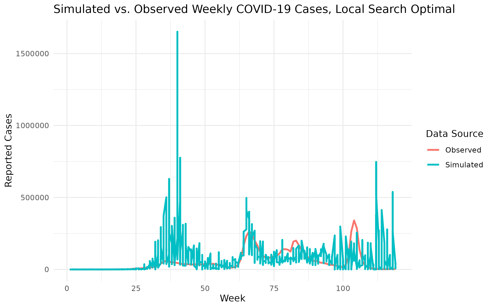

```{r setup, include=FALSE}
knitr::opts_chunk$set(echo = TRUE)
```

```{r include=FALSE}
library(forecast)
library(ggplot2)
library(dplyr)
library(tidyr)
library(kableExtra)
library(lubridate)
library(zoo)
library(fGarch, quietly = TRUE)
library(vars)
library(tseries)
library(tictoc)
library(tidyverse)
library(pomp)
library(foreach)
library(future)
library(doFuture)
library(iterators)
library(tictoc)
```

# SEIRS Model
## Introduction

### Model Specification

We propose a SEIRS (Susceptible - Exposed - Infectious - Recovered - Susceptible) Model, which is a compartmental epidemiological model that 
extends the classical SEIR model by including the transition from state $R$ to $S$, thus allowing re-infections.

```{r, echo=FALSE,fig.align="center", out.width = "60%", fig.cap = "SEIRS Diagram"}
knitr::include_graphics("./diagram.png")
```

The model can be characterized by the following system of differential equations,

\begin{align*}
    \frac{\mathrm{d}S}{\mathrm{d}t} &= -\mu_{SE} S(t) + \mu_{RS} R(t) \\
    \frac{\mathrm{d}E}{\mathrm{d}t} &= \mu_{SE} S(t) - \mu_{EI} E(t) \\
    \frac{\mathrm{d}I}{\mathrm{d}t} &= \mu_{EI} E(t) - \mu_{IR} I(t) \\
    \frac{\mathrm{d}R}{\mathrm{d}t} &= \mu_{IR} I(t) - \mu_{RS} R(t) \\
\end{align*}

where

-   $\mu_{SE} = \beta(t)$ is the transition rate from state $S$ to state $E$, also known as the *transmission rate*;
-   $\mu_{EI}$ is the transition rate from state $E$ to state $I$;
-   $\mu_{IR}$ is the transition rate from state $I$ to state $R$;
-   $\mu_{RS}$ is the transition rate from state $R$ to state $S$;
-   $N(t) = S(t) + E(t) + I(t) + R(t)$ is the population size, which is assumed to be constant throughout the epidemic.

In order to discretize the model, we assume that each transition between compartments is a *binomial* random variable, *i.e.* 
\begin{align*}
\Delta N_{SE} &= Binomial(S, 1 - e^{-\beta(t) \frac{I \Delta t}{N}}) \\
\Delta N_{EI} &= Binomial(E, 1 - e^{-\mu_{EI} \Delta t}) \\
\Delta N_{IR} &= Binomial(I, 1 - e^{-\mu_{IR} \Delta t}) \\
\Delta N_{RS} &= Binomial(R, 1 - e^{-\mu_{RS} \Delta t}) \\
\end{align*}

As demonstrated in earlier sections, the sample period can be segmented into three distinct phases. Accordingly, we allow the transmission rate, $\beta(t)$, 
the dispersion coefficient, $k$,and the reporting rate $\rho$, 
 to vary across these phases to reflect changes in underlying epidemic dynamics.
Specifically, let $\beta(t), k(t), \rho(t)$ be piecewise functions *s.t.*
\begin{equation*} \beta(t) = \left\{
\begin{matrix}
b_1, & t \in [1, 61] \\
b_2, & t \in [62, 96] \\
b_3, & t \in [63, 119]
\end{matrix}
\right.\end{equation*}
\begin{equation*} k(t) = \left\{
    \begin{matrix}
    k_1, & t \in [1, 61] \\
    k_2, & t \in [62, 96] \\
    k_3, & t \in [63, 119]
    \end{matrix}
\right.\end{equation*}

\begin{equation*} \rho(t) = \left\{
    \begin{matrix}
    \rho_1, & t \in [1, 61] \\
    \rho_2, & t \in [62, 96] \\
    \rho_3, & t \in [63, 119]
\end{matrix}\right.\end{equation*}

Note that $k$ and $\rho$ controls the negative binomial distribution for the number of reported cases $Y(t)$, *i.e.* 
$$ Y(t) \sim NegBinom(\rho * H, \rho * H + \frac{(\rho H)^2}{k(t)}) $$


### Why not SEIR

We do not start with the SEIR model since it assumes that recovered individuals gain *permanent* immunity, which is inconsistent with 
the multiple outbreaks we have observed in Kerala during the sample time interval. 

Alternatively, we consider adding the $R \rightarrow S$ route in order to allow recovered individuals to lose immunity over time, return 
to the susceptible state, thus enabling re-infections. 
Without this transition, the SEIR model would eventually trap all individuals in $R$ forever with enough time, leading to unrealistic depletion 
of susceptibles and underestimation of future waves. 

### Why Time-varying $k$ and $\rho$

At the very beginning, we began our analysis with a SEIRS model featuring time-varying transmission rates,
while initially holding the dispersion parameter $(k)$ and the reporting rate $(\rho)$ fixed. 
This setup was meant for simplicity, and to capture changes in disease transmission. 

**SHORTLY DISCUSS PROBLEMS**
**SIMULATION PLOT, BEST PARAMS, GLOBALLY**


Our next step was to allow the dispersion parameter $k$ in the negative binomial distribution to be time-varying. 
Reporting consistency across epidemic phases due to factors such as evolving testing policies, delays, or 
improvements in data infrastructure, which lead to varying levels of noise in reported case counts. A fixed \(k\) 
cannot capture this non-constant overdispersion. 

**WHAT ARE THE IMPROVEMENTS?**
**WHAT PROBLEMS STILL NEED TO BE ADDRESSED**
**SIMULATION PLOT, BEST PARAMS, GLOBALLY**


Finally, varying only \(k(t)\) allows the model to adjust the **dispersion** (i.e., variability) around the expected number of 
reported cases, but it does **not** affect the **mean** of the observation distribution. As a result, it cannot account 
for changes in the actual **level of underreporting or detection bias** over time. If the true proportion of cases being 
reported fluctuates due to changes in testing access, public behavior, or policy, this cannot be captured by adjusting \(k(t)\) alone.

In combination with time-varying \(k(t)\), varying \(\rho(t)\) 
allows the model to separately account for both **changes in case detection** and **changes in reporting consistency**, leading 
to improved fit, more realistic epidemic dynamics, and better-informed inference about transmission and immunity. This is how we 
derived our final model.


**More details about the earlier models can be found in the Appendix.**

## Initial Guesses
We begin with a population size of $N = 34,530,000$, which is derived based on the 2011 cencus data and an annual growth rate of **fill in the blank** 
For simplicity, $N$ is assumed to be constant throughout the sample time period. The initial guess for the parameters are as follows.
\begin{equation*}\left\{\begin{matrix}
  b_1 = 3, b_2 = 50, b_3 = 20, \\
  \mu_{EI} = 1.67, \mu_{IR} = 0.4, \mu_{RS} = 0.005, \\
  \rho_1 = 0.12, \rho_2 =0.4, \rho_3 = 0.5 \\
  k_1 = 2.5, k_2 = 4, k_3 = 0.5 \\
  \eta = 0.1 \\
\end{matrix}\right.\end{equation*}

We expect $b_2$ to be greater than $b_1$ since the second outbreak features a larger magnitude, which suggest rising transmissibility. Comparatively, $b_3$ is assumed to be 
moderately less than $b_2$ to compensate for the heavy infections already caused by the 2nd outbreak, ensuring the third wave doesn't unrealistically overshoot due to a 
reduced susceptible population.

Additionally, the median incubation period is roughly 4.5-5.8 days
^[Lauer, S. A., Grantz, K. H., Bi, Q., Jones, F. K., Zheng, Q., Meredith, H. R., Azman, A. S., Reich, N. G., & Lessler, J. (2020). The Incubation Period of Coronavirus Disease 2019 (COVID-19) From Publicly Reported Confirmed Cases: Estimation and Application. Annals of internal medicine, 172(9), 577–582. https://doi.org/10.7326/M20-0504].
The infectious period is usually believed to be 1-2 days before and 8-10 days after symptoms begin. To include a buffer for late recovery or reporting delays, 
we assume this period to be 2.5 weeks. 
Hence, we set $\mu_{EI} = 1.67$, and $\mu_{IR} = 0.5$

Moreover, $\eta$ is set to $0.1$ considering the large population size in Kerala. Large $N$ implies high absolute infection counts in spite of small proportions,
which would possibly sufficient for the early seeding of the outbreaks.

Finally, we discovered that $\mu_{RS} = 0.005$ would be a biologically plausible value.
Since the population is very large, while the cumulative number of infections remains relatively small, 
the proportion of individuals who have recovered (*i.e.*, entered the $R$ compartment) is also minimal. In such cases, 
the model is insensitive to the exact value of $\mu_{RS}$, meaning it may be safely fixed to a plausible value for improved model stability.

**We may put Puzhu's reasoning for the scales here** 


Before starting the local search, it still remains to check the particle filters and plot the simulations based the guess.
```{r echo=FALSE, fig.show="hold",out.width="49%", fig.cap="ESS Check and Simulations, Initial Guess"}
knitr::include_graphics("./results/seirs_varying_k_rho/pic/ess_init.png")
knitr::include_graphics("./results/seirs_varying_k_rho/pic/sim_init.png")
```

With the initial parameters, the model can closely capture the timing and structure of the second and the third major outbreak. However, it overestimates the sharpness 
of the third peak. The first outbreak has been significantly underestimated in terms of magnitude. Besides, the effective sample size drops 
sharply during the first outbreak (week 10-30), indicating poor particle diversity and possibly degeneracy in the particle filter.
Admittedly, the initial guesses are far from perfect, but we will see significantly improved model fit after the local search and global search.

## Local Search

We conducted the local search using 5,000 particle filters, 200 iterations. The diagnostics plot is as follows. 
```{r, echo=FALSE,fig.align="center", out.width="75%", fig.cap="Local Search Diagnostics"}
knitr::include_graphics("./results/seirs_varying_k_rho/pic/local_search.png")
```

The log-likelihood trajectories here show rapid convergence towards roughly -1,250 and stabilization, indicating that the local search 
successfully identified a high-likelihood region even in the expanded parameter space with time-varying $k$ and $\rho$.

Parameter-wise, some estimates demonstrate stable convergence, including the time-varying dispersion terms 
\(k_1, k_2, k_3\), reporting rates \(\rho_1, \rho_2\), and the recover rate $\mu_{IR}$, while others may suffer poor convergence and 
weak identifiability, especially \(b_2\), \(\mu_{EI}\), and $\rho_3$. 

In addition, unlike results from simpler models(they can be found in 
the appendix) where \(\eta\) decreased steadily, here it **increases over iterations**, which may better reflect a realistic 
susceptible population size. 

Finally, $b_3$ $may still be problematic since it rapidly declines and converges toward zero, which could be
the the model attempting to compensate for prior infection dynamics by downweighting $b_3$, despite the visible spike in observed cases.  
Overall, despite the rich parameterization, the model remains well-behaved and converges stably.


The locally optimal parameters and the simulation based on them are as follows.
```{r, echo=FALSE, fig.align="center",out.width="70%", fig.cap = "Simulations, Local Search"}
results_local = readRDS("./results/seirs_varying_k_rho/lik_local.rds")
results_local_maxll = results_local |> arrange(desc(loglik)) |> slice(1)
best_params_local = results_local_maxll |> as.list() |> unlist()
as.data.frame(t(best_params_local))
knitr::include_graphics("./results/seirs_varying_k_rho/pic/sim_local.png")
```

This simulation aligns closely with the observed data in terms of overall wave timing and peak locations, 
especially during the first two outbreak periods. Overall, the fit demonstrates strong agreement with the empirical trend while allowing for stochastic variation.

## Global Search

```{r}

```

## Profile Likelihood


## An Extra Round of Searches
### Why?
As discussed above, the profile likelihood plots reveal a data point with a remarkably high log-likelihood, 
corresponding to a set of stable and plausible parameters. We therefore decided to proceed with a follow-up investigation.
Specifically, we have replace the initial parameters for the local search with those from the data point, while keeping all 
other configurations:

\begin{equation*}\left\{\begin{matrix}
  b_1 = 2.33, b_2 = 3.68, b_3 = 11.40, \\
  \mu_{EI} = 1.67, \mu_{IR} = 0.4, \mu_{RS} = 0.005, \\
  \rho_1 = 0.07, \rho_2 =0.51, \rho_3 = 0.11 \\
  k_1 = 1.26, k_2 = 6, k_3 = 2.8 \\
  \eta = 0.62 \\
\end{matrix}\right.\end{equation*}


### Local Search 2
Let's revisit the diagnostics. The log-likelihood reaches -1,230 after 200 iterations and still exibits an upward trend. Most
parameter show strong signs of convergence except for $\eta$ and $\rho_1$. More importantly, the estimated parameters now have
better inteprability, particularly $\mu_{IR}$, which is now centered around 1.0 $\mathrm{week}^{-1}$ rather than 0.01$\mathrm{week}^{-1}$. 
What a relief for those living in the simulated world to hear that it no longer takes almost half a year to recover from COVID.

```{r, echo=FALSE,fig.align="center", out.width="75%", fig.cap="Local Search Diagnostics"}

```

The simulations looks similar to the previous model, although there is still spike at the first outbreak which is not supposed to exist.
```{r, echo=FALSE, fig.align="center",out.width="70%", fig.cap = "Simulations, Local Search"}
results_local = readRDS("./results/seirs_global2/lik_local.rds")
results_local_maxll = results_local |> arrange(desc(loglik)) |> slice(1)
best_params_local = results_local_maxll |> as.list() |> unlist()
as.data.frame(t(best_params_local))

```


### Global Search 2
 

# Appendix 
## SEIRS, with Constant $k$ and $\rho$

### Initial Guesses
\begin{equation*} \left\{
\begin{matrix}
  b_1 = 5, b_2 = 10, b_3 = 20, \\
  \mu_{EI} = 1.67, \mu_{IR} = 0.5, \mu_{RS} = 0.005, \\
  \rho = 0.4, \\
  k = 10, \\
  \eta = 0.1 \\
\end{matrix}
\right.\end{equation*}

```{r echo=FALSE, fig.show="hold",out.width="80%"}
knitr::include_graphics("./results/seirs_const/pic/sim_init.png")
```

With the initial guess, the model manages to capture the timeline for most outbreaks, but fails to estimate the magnitudes. 

### Local Search
The diagnostics plot is as follows. The log-likelihood shows rapid improvement in the early iterations, followed by clear 
stabilization around iteration 100, indicating good convergence of the local search. However, it eventually stays at roughly -1,800,
which is lower than that of the benchmark by almost 500 units.

Most parameter trajectories exhibit some variability. Fixed parameters (\(k\), \(\mu_{RS}\), \(N\)) remain constant as expected.
```{r, echo=FALSE,fig.align="center", out.width="75%"}
knitr::include_graphics("./results/seirs_const/pic/local_search.png")
```

The locally optimal parameters and the simulation based on them are as follows.
```{r, echo=FALSE, fig.align="center",out.width="70%"}
results_local = readRDS("./results/seirs_const/lik_local.rds")
results_local_maxll = results_local |> arrange(desc(loglik)) |> slice(1)
best_params_local = results_local_maxll |> as.list() |> unlist()
as.data.frame(t(best_params_local))

```
The model can closely capture the timing of the first outbreak, but it overestimates the amplitude. The second peak looks great. 
Unfortunately though, the model dies down and fails to capture any volatilities after that. 
Changes in model structure will be necessary if the global search cannot lead to significant improvements in model performance.


## SEIRS, with constant $\rho$ and Time-varying $k$
### Initial Guesses
\begin{equation*} \left\{
\begin{matrix}
  b_1 = 5, b_2 = 10, b_3 = 20, \\
  \mu_{EI} = 1.67, \mu_{IR} = 0.5, \mu_{RS} = 0.005, \\
  \rho = 0.4, \\
  k_1 = 8, k_2 = 5, k_3 = 2 \\
  \eta = 0.1 \\
\end{matrix}
\right.\end{equation*}

```{r echo=FALSE, fig.show="hold",out.width="80%"}

```

The timeframes of all three outbreaks are captured more accurately, while the magnitudes are still problematic. 

### Local Search

Compared to the previous plot, this diagnostics plot shows **much faster and more stable convergence** across both 
log likelihood and parameter trajectories. The log likelihood stabilizes quickly with minimal variability between chains, while 
improving to around -1,300, indicating better local optimization.

For parameters, the inclusion of \(k_1\), \(k_2\), and \(k_3\) leads to a slightly higher-dimensional parameter space, 
yet their trajectories converge sharply, especially \(k_1\) and \(k_3\), which stabilize early. 
In contrast to the earlier plot, this suggests **improved identifiability and reduced noise**, possibly due to better
initialization or more informative structure of the model. 
Parameters like \(b_1\), \(b_2\), and \(\mu_{IR}\) show clearer and more uniform convergence trends across chains. 
However, the steady decline of \(\eta\) across iterations is concerning, as it suggests the model increasingly favors 
a smaller initial susceptible population, which may be unrealistic. 
This could indicate issues with parameter identifiability or compensatory behavior to fit later outbreak waves.
Overall, the model appears more stable and well-calibrated than before.

```{r, echo=FALSE,fig.align="center", out.width="75%"}
knitr::include_graphics("./results/seirs_varying_k/pic/local_search.png")
```

The locally optimal parameters and the simulation based on them are as follows.
```{r, echo=FALSE, fig.align="center",out.width="70%"}
results_local = readRDS("./results/seirs_varying_k/lik_local.rds")
results_local_maxll = results_local |> arrange(desc(loglik)) |> slice(1)
best_params_local = results_local_maxll |> as.list() |> unlist()
print(best_params_local)

```
While most of the simulation aligns reasonably well with the timing and scale of observed waves, 
the first spike shows a clear anomaly from one of the simulations, in which more than 1.5 million cases are reported 
in a single week, and that is far above the observed data. 
This outlier suggests instability or overdispersion in that interval, 
likely driven by parameter uncertainty or an extreme realization, 
while the rest of the simulations remain within a plausible range.

