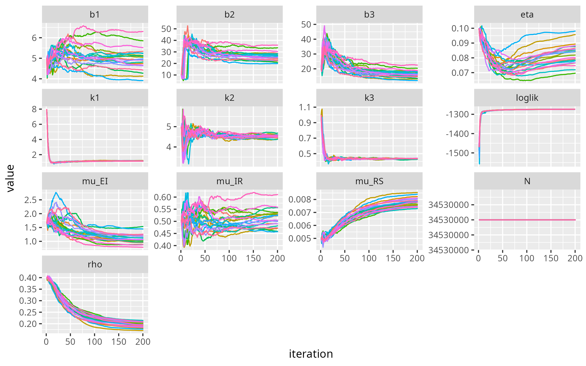

```{r setup, include=FALSE} 
knitr::opts_chunk$set(warning = FALSE,  message = FALSE) # supressing warnings 
```

# 0. Data
## 0.1 Data Source
This project uses two datasets collected from the [Kerala Government COVID-19 Dashboard](https://dashboard.kerala.gov.in), 
capturing daily records of the pandemic progression in the state.

__Covid Cases__

-   **Time range:** Feburary 2, 2020 - May 15, 2022
-   **Transformations:** We have aggregated daily data to weekly, getting __119__ observations in total.
-   **Variables:**
    -   `Date`: The reporting date
    -   `Confirmed`: Number of newly confirmed COVID-19 cases reported within the week
    -   `Recovered`: Number of individuals who recovered from COVID-19 within the week
    -   `Deceased`: Number of reported deaths due to COVID-19 within the week

```{r, echo=FALSE}
library(forecast)
library(ggplot2)
library(dplyr)
library(tidyr)
library(kableExtra)
library(lubridate)
library(zoo)
library(fGarch, quietly = TRUE)
library(vars)
library(tseries)
library(tictoc)
library(tidyverse)
library(pomp)
library(foreach)
library(future)
library(doFuture)
library(iterators)
library(tictoc)
cases <- read.csv("./data/covid_data_kerala.csv", header = TRUE)
vaccine <- read.csv("./data/daily-vaccination-in-kerala.csv", header = FALSE)
colnames(vaccine) <- c("Date", "Count")
vaccine$Date <- as.Date(vaccine$Date, format = "%m/%d/%y")
cases$Date <- as.Date(cases$Date)
cases[is.na(cases)] <- 0

```

```{r}
head(cases)
summary(cases)
```

__Vaccination__

-   **Time range:** March 18, 2021 - June 28, 2021
-   **Number of observations:** 103 daily records
-   **Variables:**
    -   `Date`: The date on which vaccinations were administered
    -   `Count`: Total number of COVID-19 vaccine doses given on that day

This shorter dataset corresponds to the initial rollout period of COVID-19 vaccinations in Kerela, and is used to investigate potential associations between vaccine uptake and pandemic dynamics.

```{r, echo=FALSE}
head(vaccine)
summary(vaccine)
```


## 0.2 EDA

```{r, echo=FALSE}
df_trimmed <- cases %>%
  slice(4:(n() - 5))

weekly_df <- df_trimmed %>%
  mutate(Week = floor_date(Date, unit = "week", week_start = 1)) %>%
  group_by(Week) %>%
  summarise(across(c(Confirmed, Recovered, Deceased), sum, na.rm = TRUE))

weekly_long <- weekly_df %>%
  pivot_longer(cols = c(Confirmed, Recovered, Deceased),
               names_to = "Status", values_to = "Count")

cut_date1 <- as.Date("2021-03-22")
cut_date2 <- as.Date("2022-01-02")
subset_1 <- subset(weekly_df, Week <= cut_date1)
subset_2 <- subset(weekly_df, Week <= cut_date2 & Week > cut_date1)
subset_3 <- subset(weekly_df, Week > cut_date2)
fig1 = "**Figure 1.** *Weekly COVID-19 Case Trends (Confirmed, Recovered, Deceased) in Kerala from January 2020 to May 2022*"
ggplot(weekly_long, aes(x = Week, y = Count, color = Status)) +
  geom_line() +
  theme_bw() +
  labs(title = "Weekly COVID-19 Trends",
       x = "Week",
       y = "Weekly Case Count",
       color = "Status")+
  geom_vline(xintercept = as.numeric(cut_date1), linetype = "dashed", color = "black") +
  geom_vline(xintercept = as.numeric(cut_date2), linetype = "dashed", color = "black") 

```

```{r, echo=FALSE}
df_trimmed <- vaccine %>%
  slice(5:(n() - 1))

weekly_vaccine <- df_trimmed %>%
  mutate(Week = floor_date(Date, unit = "week", week_start = 1)) %>%
  group_by(Week) %>%
  summarise(across(c(Count), sum, na.rm = TRUE))

weekly_long <- weekly_vaccine %>%
  pivot_longer(cols = c(Count),
               names_to = "Status", values_to = "Count")

weekly_vaccine <- weekly_vaccine %>%
  mutate(Week_Number = row_number())

fig2 = "**Figure 2.** *Weekly COVID-19 Vaccinations Administered in Kerala from March 2021 to June 2021*"

weekly_vaccine %>%
  ggplot(aes(x = Week, y = Count)) +
  geom_line(color = "blue") +
  theme_bw() +
  labs(x = "Date", y = "Vaccine Doses Administered")
```

```{r, echo=FALSE}
fig3 = "**Figure 3.** *ACF and PACF of Weekly Confirmed, Recovered, Deceased COVID-19 Cases and Vaccination Administered in Kerala, India*"
par(mfrow = c(2, 4))
confirmed.ts <- ts(data = weekly_df$Confirmed, start = c(2020, 1), frequency = 7)
acf(confirmed.ts, lag.max = 48, main = "ACF and PACF Plot")
pacf(confirmed.ts, lag.max = 48, main = "(Confirmed Cases)")

recovered.ts <- ts(data = weekly_df$Recovered, start = c(2020, 1), frequency = 7)
acf(recovered.ts, lag.max = 48, main = "ACF and PACF Plot")
pacf(recovered.ts, lag.max = 48, main = "(Recovered Cases)")

deceased.ts <- ts(data = weekly_df$Deceased, start = c(2020, 1), frequency = 7)
acf(deceased.ts, lag.max = 48, main = "ACF and PACF Plot")
pacf(deceased.ts, lag.max = 48, main = "(Deceased Cases)")

vaccine.ts <- ts(data = weekly_vaccine$Count, start = c(2020, 1), frequency = 7)
acf(vaccine.ts, lag.max = 48, main = "ACF and PACF Plot")
pacf(vaccine.ts, lag.max = 48, main = "(Vaccine Counts)")
```

```{r, echo=FALSE}
fig4 = "**Figure 4.** *Smoothed periodogram of Weekly Confirmed, Recovered, Deseased COVID-19 Cases, and Vaccination Administered*"

confirmed.ts <- ts(weekly_df$Confirmed, start = c(2020, 1), frequency = 7)
recovered.ts <- ts(weekly_df$Recovered, start = c(2020, 1), frequency = 7)
deceased.ts  <- ts(weekly_df$Deceased, start = c(2020, 1), frequency = 7)
vaccine.ts   <- ts(weekly_vaccine$Count, start = c(2021, 1), frequency = 7)

par(mfrow = c(2, 2))
spectrum(confirmed.ts, spans = c(4, 6, 4), main = "Smoothed Periodogram - Weekly Confirmed Cases")
spectrum(recovered.ts, spans = c(4, 6, 4), main = "Smoothed Periodogram - Weekly Recovered Cases")
spectrum(deceased.ts, spans = c(4, 6, 4), main = "Smoothed Periodogram - Weekly Deceased Cases")
spectrum(vaccine.ts, spans = c(4, 6, 4), main = "Smoothed Periodogram - Weekly Vaccine Count")

```

__Key Findings__

+ The confired case series is non-stationary and shows seasonality, or at least periodical behavior
+ Major outbreaks occured despite the vaccination program 
+ Low mortality rate

# 1. SEIRS
## 1.1 Model Specification

We propose a SEIRS (Susceptible - Exposed - Infectious - Recovered - Susceptible) Model, which is a compartmental epidemiological model that 
extends the classical SEIR model by assuming waning natural immunity, and consequently allowing recovered individuals to be susceptible again.

The SEIRS model can be characterized by the following system of differential equations,
\begin{align*}
\frac{\mathrm{d}S}{\mathrm{d}t} &= -\mu_{SE} S(t) + \mu_{RS} R(t) \\
\frac{\mathrm{d}E}{\mathrm{d}t} &= \mu_{SE} S(t) - \mu_{EI} E(t) \\
\frac{\mathrm{d}I}{\mathrm{d}t} &= \mu_{EI} E(t) - \mu_{IR} I(t) \\
\frac{\mathrm{d}R}{\mathrm{d}t} &= \mu_{IR} I(t) - \mu_{RS} R(t) \\
\end{align*}

where

+ $\mu_{SE} = \beta(t) \frac{I(t)}{N}$ is the transition rate from state $S$ to state $E$. $\beta(t)$ is also known as the *transmission rate*;
+ $\mu_{EI}$ is the transition rate from state $E$ to state $I$;
+ $\mu_{IR}$ is the transition rate from state $I$ to state $R$;
+ $\mu_{RS}$ is the transition rate from state $R$ to state $S$;
+ $N(t) = S(t) + E(t) + I(t) + R(t)$ is the population size, which is assumed to be constant throughout the epidemic.  

In order to discretize the model, we assume that each transition between compartments is a *binomial* random variable, *i.e.*
\begin{align*}
\Delta N_{SE} &= Binomial(S, 1 - e^{-\beta(t) \frac{I}{N} \Delta t}) \\
\Delta N_{EI} &= Binomial(E, 1 - e^{-\mu_{EI} \Delta t}) \\
\Delta N_{IR} &= Binomial(I, 1 - e^{-\mu_{IR} \Delta t}) \\
\Delta N_{RS} &= Binomial(R, 1 - e^{-\mu_{RS} \Delta t}) \\
\end{align*}

The time-varying transmission rate, $\beta(t)$, is specified as 
\begin{equation*} \beta(t) = \left\{
\begin{matrix}
b_1, & t \in [1, 61] \\
b_2, & t \in [62, 96] \\
b_3, & t \in [63, 119]
\end{matrix}
\right.\end{equation*}

Moreover, since we can observe multiple outbreaks with different volatilities in our data, 
we assume a negative binomial distribution for the number of reported cases $Y(t)$ with time-varying dispersion, *i.e.*
$$ Y \sim NegBinom(\rho * H, \rho * H + \frac{(\rho H)^2}{k(t)}) $$
where 

+ $rho$ is the reporting rate
+ $H$ is the number of total infections per week
+ $k(t)$ is the interval-specific dispersion parameter which satisfies that
\begin{equation*} k(t) = \left\{
\begin{matrix}
k_1, & t \in [1, 61] \\
k_2, & t \in [62, 96] \\
k_3, & t \in [63, 119]
\end{matrix}
\right.\end{equation*}


## 1.2 Local Search
__See the appendix for the code and the log from the most previous run.__

### Initial Parameters
```{r, eval=FALSE}
KERALA_POP = 34530000
NP = 5000; NMIF = 200; NUM_GUESSES = 400
init_params = c(b1=5,b2=10,b3=20,rho=.4, mu_EI=1/0.6, mu_IR=1/2.5, mu_RS = .005, 
                k1 = 2, k2=5, k3=1, eta=.1,N=KERALA_POP) 
step_size = rw_sd(b1 = .01, b2=.02, b3 = .02, mu_EI = .005, mu_IR = .005, 
              mu_RS = .00, rho = .002, k1 = .01, k2 = .01, k3 = .01, eta = ivp(.02))
```
```{r, fig.align="center", fig.dim=c(16, 9)}

```

### Key Findings
+ Good convergence for `loglik` and most parameters
+ $k_1$ is relatively small, which does not make much sense b/c there was no major outbreaks during the corresponding time interval.
+ 

## 1.3 Global Research 
__See the appendix for the code.__

### The Range
```{r, eval=FALSE}
runif_design(
  lower=c(b1=7, b2= 40, b3 = 30, k1 = 0.1, k2 = 4, k3 = 0, mu_EI = 1, mu_IR =0.5, rho=0.3, eta=0.1),
  upper=c(b1=9, b2 = 50, b3 = 40, k1 = 2.5, k2= 5, k3= 1, mu_EI = 1.5, mu_IR =0.6, rho=0.4, eta=0.5),
  nseq=NUM_GUESSES
) -> guesses
```

Note that we have adopted a relatively small range for the search, especially for the $b$'s, since

+ The parameters from the local search are stable 
+ In reality, the COVID is less infectious than some other diseases, such as measles. Therefore, the model is quite sensitive to the 
transmission rates, and may fail to converge if we use a larger range for them.

### Results 
```{r}
results_global = read.csv("SEIR_Global_smaller.csv")|> arrange(desc(loglik))
head(results_global, 10)
```

### Key findings 

+ Stable parameters, except for row 1
+ No significant improvement in `loglik` compared with the local search
+ `loklik` is similar to that of ARIMA, which is the benchmark


# appendix
## Code
```{r, eval=FALSE}
suppressPackageStartupMessages({
library(tidyverse)
library(pomp)
library(foreach)
library(future)
library(doFuture)
library(iterators)
})

registerDoFuture()

cores <- as.integer(Sys.getenv("SLURM_CPUS_PER_TASK"))
if (is.na(cores) || cores < 1) cores <- parallel::detectCores(logical=FALSE)

plan(multisession, workers = cores)

set.seed(1350254336)


KERALA_POP = 34530000

NP = 5000; NMIF = 200; NUM_GUESSES = 400
# NP = 200; NMIF = 10; NUM_GUESSES = 40 # debug line

cat("[INFO] Iteration parameters: Np =", NP, " | Nmif =", NMIF, "\n")

interval = c(61, 35, 23) # DO NOT change the first entry. It's the time when the vaccination program started.

cat(sprintf("[INFO] Time interval (in weeks): [1 - %d], [%d - %d], [%d - %d]\n", interval[1], interval[1] + 1, interval[1] + interval[2], 
    interval[1] + interval[2] + 1, sum(interval)))


# The code for the SEIR model is developed from https://kingaa.github.io/sbied/pfilter/model.R

covid_data = read.csv("./data/weekly_df.csv")


seir_step <- Csnippet("

  double Beta;
  if (interval == 1) Beta = b1;
  else if (interval == 2) Beta = b2;
  else Beta = b3;

  double dN_SE = rbinom(S,1-exp(-Beta*I/N*dt));
  double dN_EI = rbinom(E,1-exp(-mu_EI*dt));
  double dN_IR = rbinom(I,1-exp(-mu_IR*dt));

  double dN_RS = rbinom(R, 1 - exp(-mu_RS*dt));

  S -= dN_SE - dN_RS;

  E += dN_SE - dN_EI;
  I += dN_EI - dN_IR;
  R += dN_IR;
  H += dN_IR;
")
 
seir_init <- Csnippet("
  S = nearbyint(eta*N);
  E = 0;
  I = 1000;
  R = nearbyint((1-eta)*N);
  H = 0;
")

dmeas <- Csnippet("

  double k;
  if (interval == 1) k = k1;
  else if (interval == 2) k = k2;
  else k = k3;

  double mean_reports = fmax(rho * H, 1e-5);
  lik = dnbinom_mu(reports, k, mean_reports, give_log);
")

rmeas <- Csnippet("

  double k;
  if (interval == 1) k = k1;
  else if (interval == 2) k = k2;
  else k = k3;

  reports = rnbinom_mu(k,rho*H);"
)

emeas <- Csnippet("
  E_reports = rho*H;"
)

time_indicators = covariate_table(
    t = covid_data$Week_Number,
    interval = c(rep(1, interval[1]), rep(2, interval[2]), rep(3, interval[3])), 
    times = "t")

## MODEL INIT

init_params = c(b1=5,b2=10,b3=20,rho=.4, mu_EI=1/0.6, mu_IR=1/2.5, mu_RS = .005, 
                k1 = 8, k2=5, k3=1, eta=.1,N=KERALA_POP) 

# assumptions: 4-4.5 days of incubation period; 2 weeks of recovery period; 26 weeks of immunity

cat("[INFO] Initial model parameters:\n")
setNames(sprintf("%.2f", init_params), names(init_params))

covid_data |>
  select(Week_Number,reports=Confirmed) |>
  filter(Week_Number<=119) |>
  pomp(
    times="Week_Number",t0=1,
    rprocess=euler(seir_step,delta.t=1/7),
    rinit=seir_init,
    rmeasure=rmeas,
    dmeasure=dmeas,
    emeasure=emeas,
    accumvars="H",
    statenames=c("S", "E","I","R","H"),
    # paramnames=c("b1","b2","b3","mu_EI","mu_IR", "mu_RS", "eta","rho","k","N"),
    paramnames=c("b1","b2","b3","mu_EI","mu_IR", "mu_RS", "eta","rho","k1", "k2", "k3", "N"),
    params=init_params,
    covar = time_indicators
  ) -> COVID_SEIR


### Simulation based on initial params

sim_df <- simulate(COVID_SEIR, nsim = 1, format = "data.frame") |>
  select(Week_Number, .id, reports) |>
  mutate(source = "Simulated")

real_df <- covid_data |>
  select(Week_Number, Confirmed) |>
  rename(reports = Confirmed) |>
  mutate(source = "Observed")

(
  bind_rows(sim_df, real_df) |>
  ggplot(aes(x = Week_Number, y = reports, color = source)) +
  geom_line(linewidth = 1) +
  labs(
    title = "Simulated vs. Observed Weekly COVID-19 Cases, Init Params",
    x = "Week",
    y = "Reported Cases",
    color = "Data Source"
  ) +
  theme_minimal()
  ) |>
  ggsave(
    filename = "./pic/sim_init.png",
    plot = _,
    width = 8,
    height = 5,
    dpi = 300
  )


### A quick sanity check
ll <- replicate(10, logLik(pfilter(COVID_SEIR, Np = NP))) |>
  logmeanexp(se = TRUE)
cat("[INFO] Sanity Check: loglik =", round(ll[1], 2), " | SE =", round(ll[2], 4), "\n")


## LOCAL SEARCH
# step_size = c(b1 = .01, b2=.02, b3 = .02, rho = .002, eta = .02)
step_size = rw_sd(b1 = .01, b2=.02, b3 = .02, mu_EI = .005, mu_IR = .005, 
              mu_RS = .00, rho = .002, k1 = .01, k2 = .01, k3 = .01, eta = ivp(.02))
cat("[INFO] Local search initiated.\n")
cat("[INFO] Step size:\n")
# setNames(sprintf("%.3f", step_size), param_names)
print(step_size@call)

bake(file="local_search.rds",{
  foreach(i=1:20,.combine=c,
    .options.future=list(seed=482947940)
  ) %dopar% {
    COVID_SEIR |>
      mif2(
        Np=NP, Nmif=NMIF,
        cooling.fraction.50=0.5,
        rw.sd = step_size,
        # partrans=parameter_trans(log=c("b1","b2","b3"),logit=c("rho","eta")),
        # paramnames=c("b1","b2","b3","rho","eta")
        partrans=parameter_trans(log=c("b1","b2","b3", "k1", "k2", "k3", "mu_EI", "mu_IR",
        "mu_RS"),logit=c("rho","eta")),
        paramnames=c("b1","b2","b3", "k1", "k2", "k3", "mu_EI", "mu_IR", "mu_RS", "rho","eta")
      )
  } -> mifs_local
  attr(mifs_local,"ncpu") <- nbrOfWorkers()
  mifs_local
}) -> mifs_local


bake(file="lik_local.rds",{
  foreach(mf=mifs_local,.combine=rbind,
    .options.future=list(seed=900242057)
  ) %dopar% {
    evals <- replicate(10, logLik(pfilter(mf,Np=NP)))
    ll <- logmeanexp(evals,se=TRUE)
    mf |> coef() |> bind_rows() |>
      bind_cols(loglik=ll[1],loglik.se=ll[2])
  } -> results
  attr(results,"ncpu") <- nbrOfWorkers()
  results
}) -> results_local

results_local_maxll = results_local |> arrange(desc(loglik)) |> slice(1)
best_params_local = results_local_maxll |> select(b1:N) |> as.list() |> unlist()

cat("[INFO] Local search completed, model dumped to 'local_search.rds'.\n")
cat("[INFO] Best parameters:\n")
setNames(sprintf("%.2f", best_params_local), names(best_params_local))

cat("[INFO] Est. loglik =", round(results_local_maxll["loglik"] |> as.numeric(), 2), " | SE =", 
    round(results_local_maxll["loglik.se"] |> as.numeric(), 4), "\n")

## Plots for local search

(mifs_local |>
  traces() |>
  melt() |>
  ggplot(aes(x=iteration,y=value,group=.L1,color=factor(.L1)))+
  geom_line()+
  guides(color="none")+
  facet_wrap(~name,scales="free_y")) |>
  ggsave(
    filename = "./pic/local_search.png",
    plot = _,
    width = 8,
    height = 5,
    dpi = 300
  )


COVID_SEIR_local <- COVID_SEIR |> pomp(params = best_params_local)

sim_df_local <- simulate(COVID_SEIR_local, nsim = 1, format = "data.frame") |>
  select(Week_Number, .id, reports) |>
  mutate(source = "Simulated")

(
  bind_rows(sim_df_local, real_df) |>
  ggplot(aes(x = Week_Number, y = reports, color = source)) +
  geom_line(linewidth = 1) +
  labs(
    title = "Simulated vs. Observed Weekly COVID-19 Cases, Local Search Optimal",
    x = "Week",
    y = "Reported Cases",
    color = "Data Source"
  ) +
  theme_minimal()
  ) |>
  ggsave(
    filename = "./pic/sim_local.png",
    plot = _,
    width = 8,
    height = 5,
    dpi = 300
  )


mifs_local = read_rds("local_search.rds")
fixed_params <- c(N=34530000, mu_RS = 0.005)
coef(COVID_SEIR,names(fixed_params)) <- fixed_params

set.seed(2062379496)
runif_design(
  lower=c(b1=7, b2= 40, b3 = 30, k1 = 0.1, k2 = 4, k3 = 0, mu_EI = 1, mu_IR =0.5, rho=0.3, eta=0.1),
  upper=c(b1=9, b2 = 50, b3 = 40, k1 = 2.5, k2= 5, k3= 1, mu_EI = 1.5, mu_IR =0.6, rho=0.4, eta=0.5),
  nseq=NUM_GUESSES
) -> guesses
mf1 <- mifs_local[[1]]

foreach(guess=iter(guesses,"row"), .combine=rbind,
        .options.future=list(seed=1270401374)
) %dofuture% {
  mf1 |>
    mif2(params=c(guess,fixed_params)) |>
    mif2(Nmif=NMIF) -> mf
  replicate(
    10,
    mf |> pfilter(Np=NP) |> logLik()
  ) |>
    logmeanexp(se=TRUE) -> ll
  mf |> coef() |> bind_rows() |>
    bind_cols(loglik=ll[1],loglik.se=ll[2])
} -> seir_global_results
write.csv(seir_global_results, "SEIR_Global.csv")

```


## Local Search Logs 
```{bash, eval=FALSE}
=============================================
[INFO] New session started at 2025-04-13 19:40:42
=============================================
[INFO] Iteration parameters: Np = 5000  | Nmif = 200 
[INFO] Time interval (in weeks): [1 - 61], [62 - 96], [97 - 119]
[INFO] Initial model parameters:
           b1            b2            b3           rho         mu_EI 
       "5.00"       "10.00"       "20.00"        "0.40"        "1.67" 
        mu_IR         mu_RS            k1            k2            k3 
       "0.40"        "0.01"        "2.00"        "5.00"        "1.00" 
          eta             N 
       "0.10" "34530000.00" 
[INFO] Sanity Check: loglik = -1362.54  | SE = 0.074 
[INFO] Local search initiated.
[INFO] Step size:
rw_sd(b1 = 0.01, b2 = 0.02, b3 = 0.02, mu_EI = 0.005, mu_IR = 0.005, 
    mu_RS = 0, rho = 0.002, k1 = 0.01, k2 = 0.01, k3 = 0.01, 
    eta = ivp(0.02))
There were 20 warnings (use warnings() to see them)
There were 20 warnings (use warnings() to see them)
[INFO] Local search completed, model dumped to 'local_search.rds'.
[INFO] Best parameters:
           b1            b2            b3           rho         mu_EI 
       "8.45"       "48.17"       "35.12"        "0.35"        "0.97" 
        mu_IR         mu_RS            k1            k2            k3 
       "0.57"        "0.01"        "1.02"        "4.65"        "0.45" 
          eta             N 
       "0.04" "34530000.00" 
[INFO] Est. loglik = -1276.95  | SE = 0.0022 
[INFO] Runtime: 501 seconds
[INFO] Exit code: 0
[INFO] ----- End of Session at 2025-04-13 19:49:03 -----
```